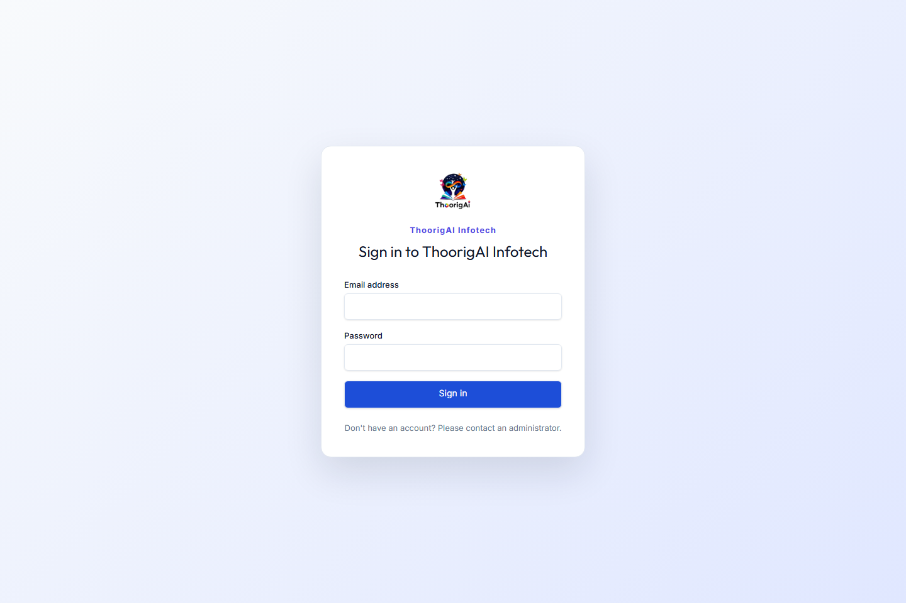
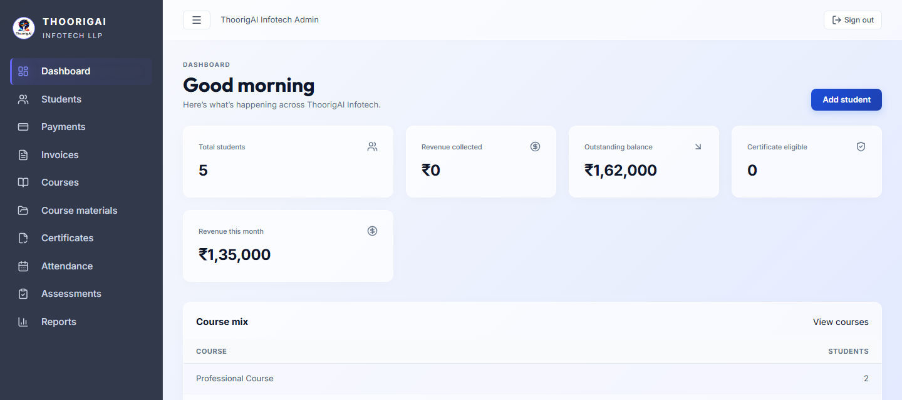

# ThoorigAI Infotech Admin Dashboard

ThoorigAI Infotech Admin Dashboard for student records, payments and invoices, courses, certificates, attendance, assessments, course materials, audit history, and public document verification.

## Screenshots

These screenshots come from the local seeded app. Regenerate them with `pnpm docs:screenshots`; the script refuses non-loopback URLs and checks that CSP-authorized theme styles rendered. The seeded data is synthetic; never use real student or payment data in screenshots.





## Stack

- Next.js 16 App Router and React 19
- Supabase Auth and Postgres
- pnpm 12
- Playwright end to end tests

## Quick start

1. Install Node.js 22, pnpm 12.3.4, and Docker Desktop with its Linux engine enabled.
2. Copy `.env.example` to `.env.local`. Use a dedicated local Supabase project for local development; see [local database setup](docs/database/local-development.md). Never put service-role or Sentry upload keys in a `NEXT_PUBLIC_` variable.
3. Install the locked dependencies with `pnpm install --frozen-lockfile`.
4. Start/reset the local database with `pnpm db:reset` and start the app with `pnpm dev`.
5. Open `http://localhost:3000`. Local seeded credentials and test data are documented in [testing](docs/testing.md); they are for local use only.

For frontend-only work, `.env.example` can be used with the local Supabase URL and publishable key printed by `pnpm exec supabase status`. Server-only routes that use private storage or readiness checks also require the local service-role key from that same local status output.

## Useful commands

```bash
pnpm dev
pnpm typecheck
pnpm lint
pnpm test:unit
pnpm test:int
pnpm test:db
pnpm test:e2e
pnpm test:ci
pnpm test:coverage
pnpm build
pnpm start
pnpm check:brand
pnpm format:check
pnpm markdownlint
pnpm build:analyze
```

## Operations and data

- [Production readiness and deployment](docs/production-readiness.md)
- [Documentation index](docs/README.md)
- [Architecture overview](docs/architecture/overview.md)
- [API reference](docs/api/openapi.yaml)
- [Performance and scale validation](docs/performance.md)
- [Release checklist](docs/release/v1.0.0-checklist.md)
- [Database migration guide](docs/database-migrations.md)
- [Feature flows and status](docs/features/feature-status.md)
- [Contributing](CONTRIBUTING.md)
- [Security policy](SECURITY.md)
- [Support](.github/SUPPORT.md)

Production deployment is **NO-GO** until the open evidence and legal/business decisions in the readiness guide and [v1.0.0 release checklist](docs/release/v1.0.0-checklist.md) are closed. Do not treat the existence of migration files as evidence that a target database has been migrated.
