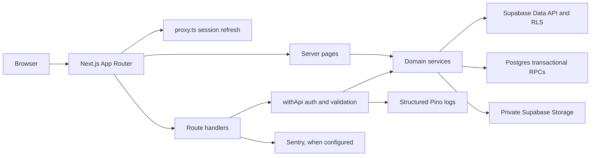
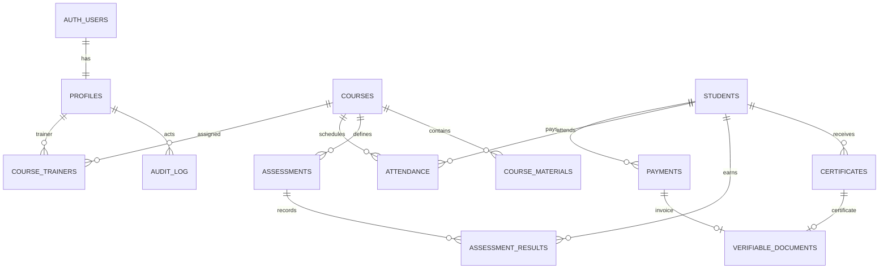

# Architecture overview

## Request and data flow

The normal app path uses the cookie-bound Supabase client and Postgres RLS. The server-only service-role client is reserved for reviewed storage operations and the readiness check; those handlers must authorize the current user before privileged work. Payment/student writes that must be atomic use Postgres RPCs. The Next route handlers are transport adapters; business rules live in `modules/*/service.ts`.

## Main data relationships

Table definitions and RLS policies are maintained in `supabase/migrations/`. The generated database types are under `lib/database.types.ts`; regenerate them with `pnpm db:types` and check drift with `pnpm db:types:check`.

## Permissions

The canonical role/action matrix is `lib/auth/permissions.ts`. The generated [role permissions table](role-permissions.md) is checked in CI with `pnpm docs:permissions:check`.

## Runtime dependencies

- Next.js 16.3 App Router on Node.js 22.
- Supabase Auth, Postgres via Data API, and private Storage.
- Vercel Functions targeted at `bom1` by `vercel.json`; confirm that the deployed database region matches.
- Sentry is optional until the Sentry project, DSN, source-map token, and alert routing are configured.
